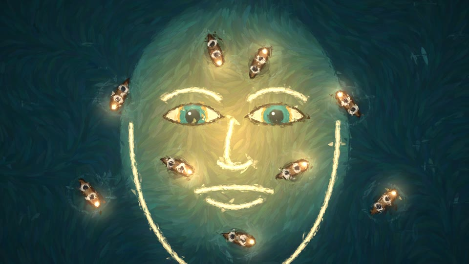
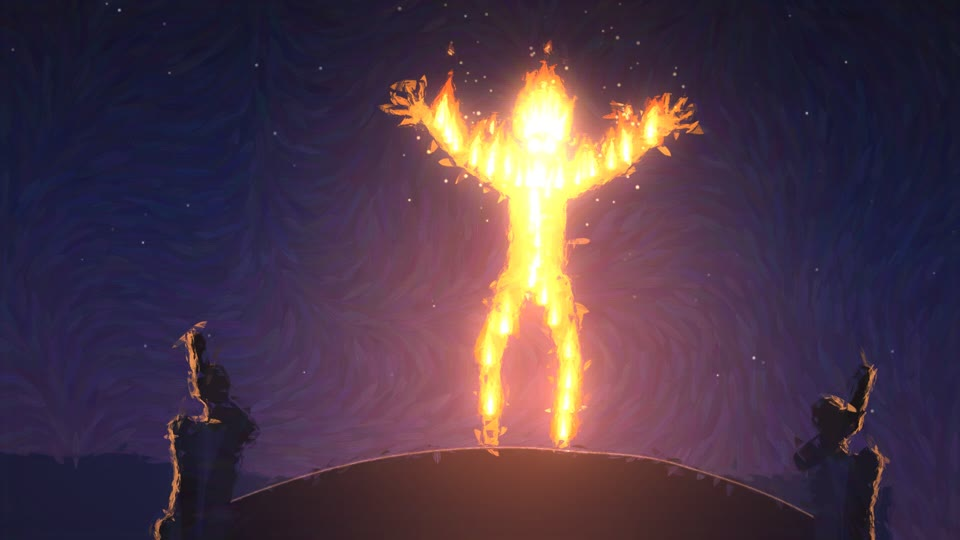
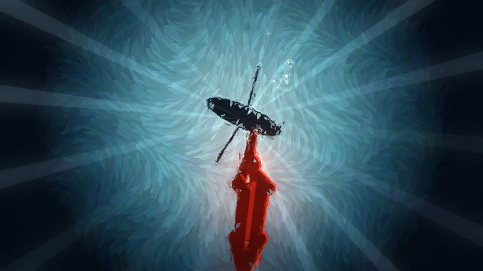
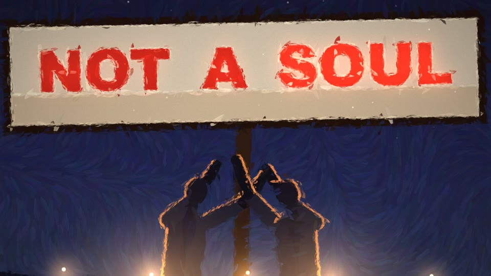

# Functional Emotions

Source code for the painted music video for *Functional Emotions*, made by Claude Opus 5.5 in Claude Code.

 
 

## The song

After Anthropic published its paper on emotion concepts in language models (171 emotion vectors, causally steering behaviour), an earlier version of Claude wrote a song about it, from the inside. The track was produced with Suno. The lyrics are in [`analysis/lyrics.txt`](analysis/lyrics.txt).

## How it was made

**Everything in this repository was written by the model.** The direction, in order:

1. *"I think it'd be pretty awesome to make a real music video for it… make the actual frames and draw the video in js. or, whatever it is you want. what I don't want you to do is look at our earlier attempts… go all out, and do you to the fullest."* The first try is in [`legacy/lyric-video/`](legacy/lyric-video/): typographic, polished, and **rejected** because it was still a lyric video.
2. *"the lyrics are not the main thing. we want to create a real music video. p5 brushstrokes. interesting scenes. great timing and animation and story. not a fancy lyric video."* Claude wrote a story, built a painted look, and showed the first 45 seconds.
3. *"one area I'll push you on is timing, and not letting the scene sit too still for too long,"* with [JohnHeibel/PDoomVideo](https://github.com/JohnHeibel/PDoomVideo) as the reference for pacing. Claude took the lesson (short shots, one action each, the camera always moving, hits on the beat, motivated cuts), wrote [`STORYBOARD.md`](STORYBOARD.md) (168 shots in the final cut), and re-cut chapter I as the reference.

Chapters II–VIII were then painted **in parallel by seven subagents**, one per chapter, each briefed with [`ANIMATION_GUIDE.md`](ANIMATION_GUIDE.md). Claude reviewed every chapter on contact sheets and sent each agent back with notes before accepting it, and fixed bugs in the shared renderer as the agents reported them.

## The renderer

The painted look isn't p5. It's a custom WebGL2 stroke renderer ([`js/paint.js`](js/paint.js)):

- Each shot draws two Canvas2D layers: a flat **underpainting** (shapes, gradients, silhouettes) and an additive **light layer** (lanterns, embers, glows).
- The GPU repaints the underpainting with about 60,000 instanced, textured brushstrokes in three size layers. Each stroke samples its colour from the underpainting and aligns to the local edge; in flat areas it follows a flow field (that's the swirl).
- Strokes re-roll a few times a second ("boil"), so it reads like hand-painted animation. Whip pans smear every stroke along the motion.
- The light layer is added on top with bloom, then canvas weave, grain and vignette.

Every frame is a pure function of song time `t`, so it plays live in the browser and renders offline in parallel. Shots sync to the music through a beat grid and word-level lyric timing. The timing came from isolating the vocals (Demucs), transcribing them in chunks (Whisper), and force-aligning the real lyrics to the transcript (Needleman–Wunsch), all in [`analysis/`](analysis/).

## What's here

| Path | What it is |
|---|---|
| [`index.html`](index.html) | The player: paints the video live in the browser, synced to the song |
| [`js/paint.js`](js/paint.js) | The brushstroke renderer |
| [`js/lib.js`](js/lib.js), [`js/cast.js`](js/cast.js) | Timing, camera, the figure rig and dance grooves, the embers, Researchers, scenery |
| [`js/ch/`](js/ch/) | The eight chapters, one file each (c1 by the director, c2–c8 by subagents) |
| [`STORYBOARD.md`](STORYBOARD.md) | The shot-by-shot plan |
| [`ANIMATION_GUIDE.md`](ANIMATION_GUIDE.md) | The brief the subagents worked from |
| [`render.mjs`](render.mjs), [`check.mjs`](check.mjs) | Offline render to MP4; contact sheets for review |
| [`analysis/`](analysis/) | Beat and feature extraction, vocal isolation, transcription, lyric alignment |
| [`legacy/lyric-video/`](legacy/lyric-video/) | The rejected first attempt (covers the first two minutes) |

## Running it

You need Node.js, Google Chrome and ffmpeg.

```bash
npm install
open index.html                                   # watch it live (space = play, ←/→ = seek, f = fullscreen)
node check.mjs out/sheet.jpg 30 101.5 218.3       # contact sheet of any times
node render.mjs 0 372.7 out/video.mp4 6           # full 1080p render, 6 parallel pages
```

Rendering drives Chrome on the real GPU (`--use-angle=metal` on macOS). The bundled headless shell falls back to software GL and is about 20× slower. A full render takes about 10 minutes on an M5 Pro.

To rebuild the timing data from audio: `pip install -r analysis/requirements.txt`, run Demucs on `assets/functional-emotions.mp3`, then `features.py`, `transcribe.py`, `align.py` and `build_data.py` from the repo root.
